::: {.callout-note}
## この文書について

オントロジー、セマンティクス、データモデル標準化という語が何を指すのかを整理した調査報告である。
事実の記述には出典を付けた。筆者の解釈は「考察」と明示した節と段落に分けて書いた。

この文書は  版である。


:::

# はじめに：初めて読む人のために {#sec-intro}

オントロジーやデータモデルに初めて触れる読者のために、専門用語をできるだけ使わずに、問題の全体像を説明する。内容に詳しい読者は @sec-summary から読んでよい。

## 何が問題なのか

ある部品を、どの会社から仕入れているか。これを記録する表は、どの会社にもある。ところが、その列の名前は会社ごとに違う。A 社は `supplier_id`、B 社は「仕入先コード」、C 社は `vendor` と呼んでいるかもしれない。

人が見れば、三つとも同じものを指していそうだと見当がつく。ただし、名前だけでは断定できない。`vendor` には、部品の仕入先のほかに、保守や物流の委託先が含まれているかもしれない。人は、担当者に尋ねたり定義書を読んだりして確かめる。

最近の AI も、列の名前から同じものだと推測できる。しかし人の見当と同じく、それは推測である。そのうえ、同じデータを渡しても毎回同じ答えになるとは限らず、外れたときにそれと気づく手がかりも乏しい、と筆者は考える。Apache Ossie のプロジェクトも、当事者の立場から、人の分析者や AI エージェントがどの定義が正しいかを推測しなければならない状況は望ましくないと述べている [@ossie_incubator_2026]。業務で三社のデータを突き合わせるには、どの列とどの列が同じものを指すのかを、あとから確かめられる形で決めておく必要がある。

逆の問題もある。同じ名前で、違うものを指す場合である。

二つの会社の部品表に、どちらも「重量」という列があるとする。一方はグラム、もう一方はキログラムで記録しているかもしれない。梱包を含む重さか、部品そのものの重さかも、名前だけでは分からない。「価格」が税込か税抜か、「日付」が発注日か納品日かも同じである。名前がそろっていても、意味がそろっているとは限らない。

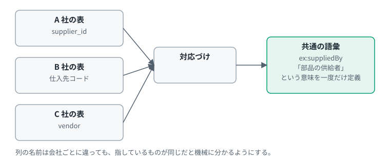{#fig-el-intro width=90%}

## 四つの言葉をひとことで

この報告書の題名にある三つの言葉と、その前提になる「データモデル」を、まず大づかみに押さえておく。正確な定義は @sec-terms にある。

四つの言葉の関係は、「意味の三角形」と呼ばれる古典的な図に重ねると分かりやすい。Ogden と Richards は 1923 年の著書で、記号（Symbol）、思考または指示（Thought or Reference）、指示対象（Referent）の三つを三角形の頂点に置いた。記号と指示対象は直接にはつながらず、思考を介してつながるという [@ogden_richards_1923]。この報告書では、分かりやすさのために、頂点を「記号」「概念」「対象」と呼び替える。原典は「概念」という語を使っていない。

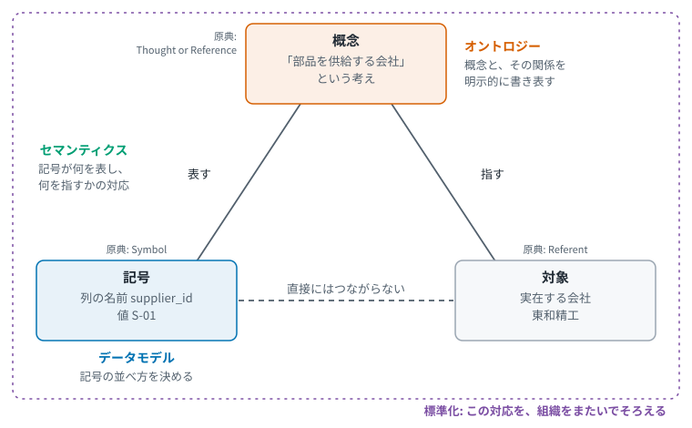{#fig-el-triangle width=90%}

`supplier_id` という列の名前は記号である。それが表す「部品を供給する会社」という考えが概念で、実在する会社が対象にあたる。四つの言葉は、この三角形のどこを扱うかが違う。機械に意味をどこまで渡すかという段階との関係は、@sec-ladder で示す。

**データモデル**

データの形を決めたものである。どんな項目があり、それぞれがどんな型の値を持ち、項目どうしがどうつながるかを決める。デジタル庁の政府相互運用性フレームワーク（GIF）は、データの構造や項目に加えて、データとデータの関係性を定義したものと説明している [@digital_agency_gif_outline_2025]。データの持ち方は表に限らない。JSON のような入れ子の文書も、点と線でつなぐグラフもある。どの持ち方にも、形の取り決めとしてのデータモデルがある（@sec-elements）。

**セマンティクス**

データの意味のことである。「supplier_id は、その部品を供給している会社を指す」という取り決めがセマンティクスにあたる。データモデルが形を決めても、意味までは決まらない。

**オントロジー**

ある分野に出てくる概念と、その関係を、明示的に書き表したものである。知識工学では「概念化の明示的な仕様」と定義されてきた [@gruber_1993]。「部品」「供給者」「供給する」といった概念を定義する。OWL のような言語で書けば、計算機がその内容を処理できる [@w3c_owl_2004]。

**データモデル標準化**

組織をまたいで、データモデルをそろえるための取り決めである。そろえるのは、まずデータの形である [@digital_agency_gif_outline_2025; @iec_63278_1_2023]。ただし、形がそろっても意味がそろうとは限らない。そのため標準化は、語彙の取り決めにも及ぶ [@ipa_interoperability_guide_2021; @dsp_2025_catalog]。全員に同じものを使わせる方法だけでなく、別々の言葉を対応づける方法もある [@ipa_interoperability_guide_2021]。

## なぜ今これが話題になるのか

理由は二つある。

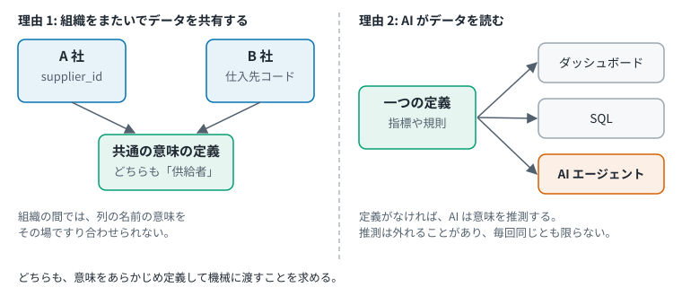{#fig-el-why-now width=95%}

一つ目は、組織をまたいでデータを共有する仕組みである。欧州相互運用性フレームワークは、相互運用性を整理する 4 層の一つに意味の層を置く [@ec_eif_2017]。日本の ODS-RAM も、4 つのレイヤの一つにセマンティクスレイヤを置く [@ods_ram_layers]。詳しくは @sec-dataspace で扱う。

二つ目は、AI にデータを使わせる製品の動きである。Databricks は、指標や規則を一度定義すれば、ダッシュボードも SQL も AI エージェントも同じ定義で動くと説明している [@databricks_semantics_2026]。これは製品ベンダの説明である。最初の節で述べたとおり、AI の推測は安定しない。意味をあらかじめ定義して AI に渡しておく必要がある、と筆者は考える。

## 歴史は四本の流れに分けると見通しがよい

この分野の取り組みは、1970 年代のデータベース研究から 2026 年の企業の仕様づくりまで、半世紀にわたる。筆者はこれを四本の流れに分けて整理した。流れごとに、何のための取り組みか、何が得られるか、そのために何をするかを分けて示す。

| 流れ | 何のために | 得られるもの | そのためにすること | 代表例 |
|---|---|---|---|---|
| データベース系 | データを保存し、複数のプログラムで共有する | 同じデータを、別々のプログラムから同じ形で使える | データの形を、表や図で取り決める | 関係モデル、実体関連モデル |
| 知識表現系 | 人が持つ知識を、計算機に扱わせる | 書かれていないことを、定義から導ける | 概念とその関係を、論理として書き表す | 記述論理、上位オントロジー |
| Web 標準系 | 組織をまたいで、データの意味を共有する | 出どころの違うデータを、そのまま突き合わせられる | 共通の書き方と語彙を、標準として定める | RDF、OWL、DCAT |
| 分析系 | 指標の計算方法を、一つにそろえる | どのツールで集計しても、同じ数字になる | 指標の定義を一か所に置き、各ツールから参照する | セマンティックレイヤ、Apache Ossie |

: 四本の流れの目的と手段（筆者の整理） {#tbl-streams}

四本は目的が違う。同じ「セマンティック」という言葉も、Web 標準系では組織をまたぐ意味の共有を、分析系では指標の計算方法の統一を指すと考えられる（@sec-compare）。この報告書を読むときは、いまどの流れの話をしているかを意識すると混乱しにくい。流れごとの出来事は @fig-lineage に年表としてまとめた。

## この報告書の読み方

| 知りたいこと | 読む場所 |
|---|---|
| 結論だけ知りたい | @sec-summary |
| 用語の正確な定義 | @sec-terms |
| 全体の流れを図で見たい | @fig-lineage |
| RDF や OWL などが何か知りたい | @sec-elements |
| 米国企業の最近の動き | @sec-us |
| データスペースとの関係 | @sec-dataspace |
| 流れごとの比較 | @sec-compare |

: 目的別の読み方 {#tbl-guide}

# エグゼクティブサマリ {#sec-summary}

**調査の問い**

「オントロジー」「セマンティクス」「データモデル標準化」という語は、時代と業界によって指すものが違う。
この調査では、その違いを、1970 年代の研究から近年の米国企業の取り組みまで並べて整理した。

**主要な発見**

1. **「オントロジー」には少なくとも三つの用法がある。**
   - **知識工学の用法**: 概念化を明示的に書き表した仕様を指す。Gruber が「概念化の明示的な仕様」と定義し [@gruber_1993]、Studer らは、Gruber と Borst の定義を踏まえて「共有された概念化の、形式的で明示的な仕様」とした [@studer_1998]。
   - **Web 標準の用法**: OWL のような、形式的に定義された意味を持つオントロジー言語で書いたものを指す [@w3c_owl2_2012]。日本の ODS のオープンソース実装も、この用法で「ODS オントロジー」を定義している [@ods_oss_ontology_ttl]。
   - **製品の用法**: Palantir は自社の Ontology を、組織の「運用レイヤ」と定義している [@palantir_ontology_overview_2026]。
2. **系譜は四本に整理できる。** この分類は筆者の整理である。
   データベース系（関係モデル、実体関連モデル）、知識表現系（KL-ONE、Cyc、記述論理）、Web 標準系（RDF、OWL、SKOS、SHACL、JSON-LD、DCAT）、分析系（セマンティックレイヤ）である。
3. **米国企業の近年の動きは分析系から始まり、オントロジーへ範囲を広げている。**
   Open Semantic Interchange（OSI）は 2025 年 9 月 23 日に Snowflake らが発表した [@snowflake_osi_pr_2025]。
   その後 Apache Incubator に受け入れられ、Apache Ossie (Incubating) に改称された。Apache 側の記録ではインキュベーション開始は 2026 年 6 月 22 日である [@incubator_ossie_status; @ossie_incubator_2026]。
   プロジェクトのブログ記事は Ossie を「セマンティックレイヤとオントロジーの両方のためのオープン仕様」と説明している [@ossie_incubator_2026]。
   Google Cloud は 2026 年 6 月 12 日付の記事で、知識を Markdown のファイルで表す Open Knowledge Format を発表した [@google_okf_intro_2026]。型の語彙を固定せず、意味の多くを文章のまま渡して、解釈を読み手の言語モデルに任せる形式である（@sec-okf）。
4. **データスペースプロトコルは Web 標準系の語彙を再利用している。**
   同プロトコルは DCAT と ODRL の語彙を再利用し、JSON-LD 1.1 を用いる [@dsp_2025_catalog; @dsp_2025_common]。
   日本の ODS-RAM は 4 レイヤの一つとしてセマンティクスレイヤを置く [@ods_ram_layers]。設計思想として開世界仮説を前提に置き、オープンソース実装は OWL で書いたオントロジーと SAMM を使う（@sec-ds-jp）。

**考察にもとづく示唆**

- 技術は「機械が意味について何をできるようになるか」という一本の軸で、4 段に並べると整理しやすい（@sec-ladder）。
- Web 標準系と分析系は、同じ「セマンティック」という語を使うが、解く問題が違う。混ぜずに並べて示すほうがよいと考えられる（@sec-compare）。

**確認できなかった点**

一部の事項は一次情報で裏づけられなかった。該当する日付は本文に書かず、@sec-gaps にまとめた。

# 調査の範囲 {#sec-method}

調査は 2026 年 10 月 2 日時点の公開情報にもとづく。
標準文書、学術論文、公的機関の文書を優先し、企業の動きは各社の公式発表と公式文書で確認した。
企業の公式発表は当事者の主張であって、中立な評価ではない。

# 用語の整理 {#sec-terms}

## この報告書で使う整理の軸 {#sec-axes}

この分野の用語が分かりにくいのは、一つの軸では整理しきれないためである。この報告書は、次の五つの軸を使い分ける。それぞれ、並べるものも、分かることも違う。

| 軸 | 何を並べるか | 意図 | 得られる効果 | 出どころ | 扱う場所 |
|---|---|---|---|---|---|
| 意味の三角形 | 記号、概念、対象の三つ（呼び名は筆者の言い換え） | 言葉が何を扱っているかを見分ける | データモデル、セマンティクス、オントロジーの違いが分かる | Ogden と Richards | @sec-intro |
| 意味の指定の強さによる連続体 | 成果物の種類。用語集からオントロジーまで | 成果物がどれだけ形式的かを比べる | 既存の議論の中での位置づけが分かる | Uschold と Gruninger | @sec-spectrum |
| 意味の 4 段階 | 機械にできること | 意味をどこまで機械に渡すかを比べる | ある技術で何ができ、何ができないかが分かる。必要な技術を選ぶ手がかりになる | 筆者 | @sec-ladder |
| 四本の流れ | 取り組みの系譜。誰が何のために進めてきたか | 目的の違いを見分ける | 同じ言葉が流れごとに別の課題を指す、という混乱を解ける | 筆者 | @sec-history |
| 共有の範囲 | 一つの組織の中か、組織をまたぐか | 意味を誰と共有するかを比べる | 製品のオントロジーと、データスペースの取り組みの違いが分かる | 筆者 | @sec-dataspace、@sec-compare |

: この報告書で使う整理の軸 {#tbl-axes}

五つの軸は、互いに置き換えられるものではない。たとえば、意味の指定の強さによる連続体と意味の 4 段階は、どちらも四つに分かれているが、並べているものが違う（@tbl-spectrum-vs-ladder）。意味の三角形と意味の 4 段階の関係は @fig-el-triangle-steps に、意味の 4 段階と四本の流れの関係は @sec-ladder-streams に示す。

出どころが「筆者」の軸は、この報告書のための整理であり、確立された分類ではない。

**考察：なぜ独自の軸を加えたのか**

先行する二つの軸は、人が言葉や成果物を見分けるための整理である。意味の三角形は言葉が何を扱うかを示し、連続体は成果物がどれだけ形式的かを示す。連続体の原典は、右へ進むほど自動推論への支援が増すとも述べている [@uschold_gruninger_2004]。ただし並べているのは成果物の種類であり、機械にできることを段階に分けてはいない。

近年は、この問いの重みが増していると考えられる。データを読むのが、人と分析ツールだけではなくなったためである。Snowflake らは OSI の狙いを、AI と BI のアプリケーションで一貫した業務ロジックを確保することと述べている [@snowflake_osi_pr_2025]。Databricks は、一度定義すればダッシュボードも SQL も AI エージェントも同じ定義で動くと説明している [@databricks_semantics_2026]。Google Cloud は Open Knowledge Format を、エージェントと人の両方に読みやすい形式として発表した [@google_okf_intro_2026]。いずれも製品ベンダの説明だが、意味の定義の読み手として AI を挙げている点が共通する。

AI の推測は安定しない（@sec-intro）。AI を業務に組み込むなら、どこまでを推測に任せ、どこからを定義として渡すかを決める必要がある。その判断には、成果物の種類よりも、機械にできることを基準にした物差しが役に立つ。

そこで筆者は、意味の 4 段階を加えた。四本の流れと共有の範囲の二つは、AI とは別の理由で加えたものである。同じ言葉が取り組みごとに別の課題を指すという混乱を解くために、誰が何のために、誰と共有するのかを分けて見る必要があった。

## 出典による定義

| 用語 | 出典による説明 | 出典 |
|---|---|---|
| オントロジー（知識工学） | "An ontology is an explicit specification of a conceptualization."（訳：オントロジーとは、概念化の明示的な仕様である。） | [@gruber_1993] |
| オントロジー（改訂版の定義） | "An ontology is a formal, explicit specification of a shared conceptualisation."（訳：オントロジーとは、共有された概念化の、形式的で明示的な仕様である。） | [@studer_1998] |
| オントロジー（工学的成果物） | 語彙と、その意味に関する明示的な前提からなる工学的な成果物 | [@guarino_1998] |
| セマンティックウェブ | 境界を越えてデータを共有し再利用できる共通の枠組み | [@w3c_semantic_web_activity] |
| 意味的相互運用性 | 交換されるデータと情報の正確な形式と意味が、やり取りを通じて保たれ理解されること。意味の側面と構文の側面の両方を含む | [@ec_eif_2017] |
| データモデル（欧州のデータスペース） | 意味的相互運用性を促すために、データ要素と関係を構造化して表したもの。語彙、オントロジー、アプリケーションプロファイル、スキーマ仕様を含む | [@dssc_blueprint_data_models] |
| 意味に関するメタデータ（日本の ODS） | データやサービスを利用するために必要な情報の意味を、ユニークかつアクセス可能な形式で定義したもの。ODS-RAM がセマンティクスレイヤの要求として定める | [@ods_ram_layers] |
| セマンティックレイヤ | データウェアハウスとそれを使うツールの間に位置するソフトウェア層。ベンダの用語集による説明である | [@atscale_semantic_layer] |
| 知識グラフ | 多様で動的かつ大規模なデータ集合を活用する場面で注目されるデータ表現 | [@hogan_2021] |

: 主要用語の出典による説明 {#tbl-terms}

英語の引用に添えた日本語訳は筆者による。

日本の ODS-RAM には、欧州の「データモデル」に当たる用語がない。対応する概念は「意味に関するメタデータ」と呼ばれる [@ods_ram_layers]。
ODS のプロトコル仕様にも「データモデル」という語はあるが、「情報モデルとして RDF を採用し、データモデルとして JSON-LD 形式や Turtle 形式を」採用するという文脈で、直列化の形式を指す [@ods_odp_metadata_exchange]。同じ語が欧州と日本で別のものを指している。

Studer らの定義は、先行する定義を踏まえたものである [@studer_1998]。
Guarino は、上位オントロジーを特定の問題や領域に依存しない一般的な概念を記述するものとした [@guarino_1998]。
同じ論文は、領域オントロジー、タスクオントロジー、アプリケーションオントロジーという区分も示している [@guarino_1998]。

## 先行する整理：意味の指定の強さによる連続体 {#sec-spectrum}

用語集からオントロジーまでを一本の軸に並べる整理は、以前からある。

Uschold と Gruninger は、用語だけの軽いものから、厳密に形式化した論理の理論までを連続体として示し、連続体に沿って進むほど、指定される意味の量と形式性の度合いが増すと述べた [@uschold_gruninger_2004]。McGuinness も、同様の図をオントロジー・スペクトラムと呼んでいる [@mcguinness_2003]。

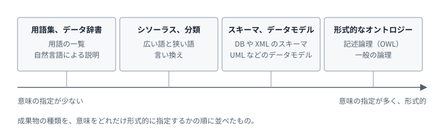{#fig-el-spectrum width=90%}

関連する区別を、ほかに二つ挙げておく。

- **情報モデルとデータモデル**: IETF の RFC 3444 は、情報モデルを実装やプロトコルに依存しない概念の水準のモデル、データモデルをそれより低い抽象度で多くの詳細を含むモデルとし、一つの情報モデルから複数のデータモデルを導けるとしている [@rfc3444]。日本の ODS も、データモデルから情報モデルを分離する（@sec-ods-concept）。
- **語彙とオントロジー**: W3C は、語彙と呼ばれるものとオントロジーと呼ばれるものの間に明確な区分はないとしている。複雑で形式的なものをオントロジーと呼ぶ傾向がある、という説明である [@w3c_ontologies_page]。

次の節で示す意味の 4 段階は、この連続体とは別のものである。どちらも四つに分かれているが、並べているものと並べる基準が違う。

| | 意味の指定の強さによる連続体 | 意味の 4 段階 |
|---|---|---|
| 誰の整理か | Uschold と Gruninger | 筆者 |
| 並べているもの | 成果物の種類。用語集、シソーラス、スキーマ、形式的なオントロジー | 機械にできること |
| 並べる基準 | 意味の指定の量と、形式性の度合い。進むほど自動推論への支援も増すとされる | 機械に渡す意味の深さ |
| 四つである理由 | 原典の図が四つの群に分けている | 筆者が四つに整理した |

: 連続体と意味の 4 段階の違い {#tbl-spectrum-vs-ladder}

二つは一対一には対応しない。連続体ではシソーラスがスキーマより手前にある。意味の 4 段階では、スキーマにあたる 1 段目が、シソーラスにあたる 3 段目より手前にある。連続体は成果物がどれだけ形式的かを見ており、4 段階は機械が何をできるようになるかを見ているためである。

## 考察：意味の 4 段階 {#sec-ladder}

以下は筆者による整理であり、特定の出典の主張ではない。この軸を加えた理由は @sec-axes に述べた。

技術は「機械が意味について何をできるようになるか」という一本の軸で、段に並べられると考えられる。2 段目から 4 段目は積み上がる。3 段目の用語の関係も、4 段目の推論も、2 段目の共通の識別子がなければ成り立たない。1 段目の検査は、これらとは独立している。RDF で書くのに JSON Schema は要らない。検査は、どの段のデータに対しても別に行える。

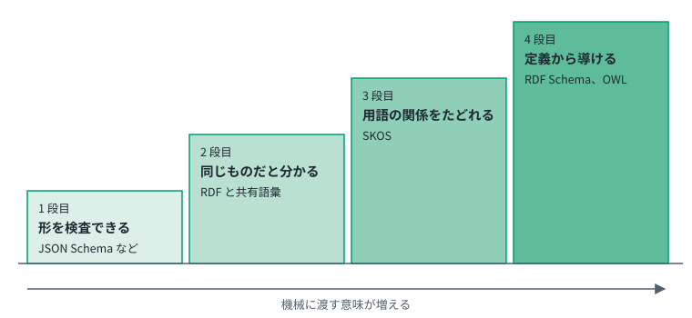{#fig-el-ladder width=90%}

| 段 | 機械ができるようになること | 部品と供給者の例 | 代表的な技術 |
|---|---|---|---|
| 1 | 形を検査できる | 重量の欄に数値が入っていると分かる | JSON Schema、XML Schema、関係モデル |
| 2 | 同じものだと分かる | A 社の列と B 社の列が、どちらも供給者を指すと分かる | RDF と共有の語彙 |
| 3 | 用語の関係をたどれる | 「ボルト」は「締結部品」より狭い語だとたどれる | SKOS |
| 4 | 定義から導ける | 供給者を持つものは調達品だと、書かれていなくても導ける | RDF Schema、OWL |

: 意味の 4 段階（筆者の整理） {#tbl-ladder}

4 段階と、@sec-history で示す四本の流れとの関係は、@sec-ladder-streams で説明する。@sec-summary で挙げたオントロジーの用法のうち、知識工学と Web 標準の用法は 4 段目にあたる。製品の用法である Palantir の Ontology は、一つの段に収まらず、複数の段にまたがる（@fig-el-off-ladder）。各技術の説明は @sec-elements にある。

**意味の三角形との対応**

4 段階は、@fig-el-triangle の意味の三角形と対応づけられる。三角形は、四つの言葉が何を扱うかを示す。4 段階は、その三角形のうち、どこまでを機械に書いて渡すかを示す。

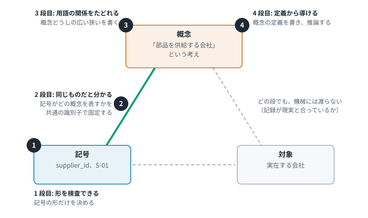{#fig-el-triangle-steps width=90%}

| 段 | 三角形のどこを機械に渡すか | 四つの言葉との対応 |
|---|---|---|
| 1 段目 | 記号の頂点だけ。列の名前や値の形を決める | データモデル |
| 2 段目 | 記号から概念への辺。この記号がどの概念を表すかを、共通の識別子で固定する | セマンティクス |
| 3 段目 | 概念の頂点の中身。用語どうしの広い狭いの関係を書く | 統制語彙、シソーラス。広い意味ではオントロジーと呼ばれることもある |
| 4 段目 | 概念の頂点の論理。概念の定義を書き、そこから推論する | オントロジー |

: 意味の 4 段階と意味の三角形の対応（筆者の整理） {#tbl-triangle-steps}

標準化は段ではない。どの段であれ、その取り決めを組織の間でそろえることを指す。

三角形のもう一つの辺、概念から対象への対応は、どの段でも機械には渡らない。記録が現実の会社と合っているかは、技術の外で確かめる必要がある。

この対応づけは筆者によるものである。Ogden と Richards の図にも、Uschold と Gruninger の連続体にも、こうした対応は書かれていない。

**一つの段に収まらない技術**

4 段階は、機械にできることを一つずつ切り出したものである。現実の技術や製品は、その一つだけを担うとは限らない。一つの段にきれいに収まらない技術には、三つの種類がある。

- **またがる**: 複数の段を、それぞれ一部ずつ備える。一つの製品や形式が、検査も同定も少しずつ受け持つ場合である。
- **同じ役割を担う**: ある段と同じ役割を、別の対象に対して果たす。新しい段を足すわけではない。
- **別の軸にある**: 段の仕組みを使ったり、その上に載ったりするが、目的が意味の深さとは別のところにある。

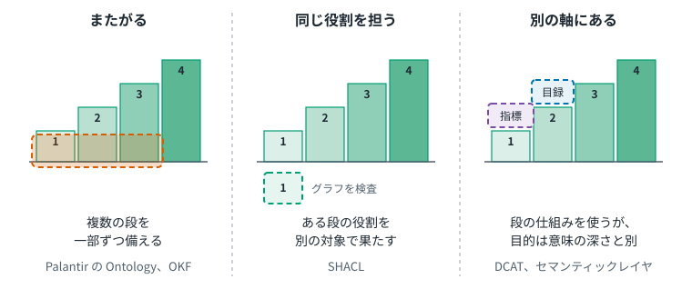{#fig-not-fit width=90%}

どの種類も、段と無関係ではない。@fig-el-off-ladder に、それぞれが関係する段を示す。

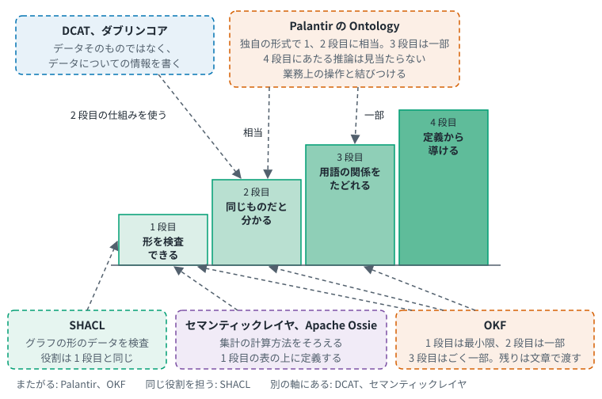{#fig-el-off-ladder width=90%}

| 技術 | 種類 | 一つの段に収まらない理由 | 関係する段 |
|---|---|---|---|
| Palantir の Ontology | またがる | W3C の標準とは別の、製品独自の形式である。意味の定義を業務上の操作と結びつける | 1、2 段目に相当する機能を持つ。3 段目は型の継承という形で一部を備える。4 段目にあたる推論は、公式文書に見当たらない（@tbl-palantir-ladder） |
| Open Knowledge Format | またがる | 意味の多くを文章のまま言語モデルに渡し、解釈を読み手に任せる | 1 段目を最小限に備える。2 段目は資産を指す URI に限って一部を備える。3 段目は種類のないリンクにとどまり、ごく一部である。4 段目は見当たらない（@tbl-okf-ladder） |
| SHACL | 同じ役割を担う | 新しい段ではなく、検査という 1 段目と同じ役割を担う | 1 段目。検査の対象が、グラフの形のデータに変わる |
| DCAT、ダブリンコア | 別の軸にある | 記述する対象が違う。データそのものではなく、データについての情報を扱う | 2 段目。共有の語彙として、2 段目の仕組みで書かれる |
| セマンティックレイヤ、Apache Ossie | 別の軸にある | 用途が違う。集計の計算方法をそろえる | 1 段目。表のデータの上に、指標の定義を置く |

: 一つの段に収まらない技術（筆者の整理） {#tbl-off-ladder}

# 歴史の系譜 {#sec-history}

## 四本の流れ

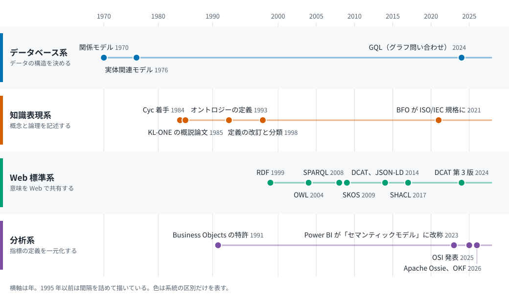{#fig-lineage width=100%}

@fig-lineage は筆者による整理である。どの出来事をどの系統に置くかは筆者の分類で、系統の間の影響関係は図に描いていない。年は @tbl-timeline の出典による。

## 年表

| 年月 | 系統 | 出来事 | 要点 | 出典 |
|---|---|---|---|---|
| 1970 年 6 月 | データベース | Codd の論文が Communications of the ACM に掲載 | データの関係モデルを提案した | [@codd_1970] |
| 1976 年 3 月 | データベース | Chen の論文が ACM TODS に掲載 | 実体関連モデルを提案し、データの統一的な見方を目指した | [@chen_1976] |
| 1984 年 | 知識表現 | Lenat らが Cyc の構築に着手 | 人間の常識にあたる一般的な概念を、大規模に記述する試みが始まった（筆者の要約） | [@lenat_1995] |
| 1985 年 4 月 | 知識表現 | KL-ONE の概説論文が Cognitive Science に掲載 | 知識表現システム KL-ONE の全体像が示された | [@brachman_1985] |
| 1991 年 | 分析 | Business Objects が、関係データベースへの問い合わせ技術の特許を出願（優先日は 11 月 27 日） | 利用者が関係構造や SQL を知らなくても問い合わせられる仕組みが示された | [@business_objects_patent_1996] |
| 1993 年 | 知識表現 | Gruber がオントロジーを定義 | オントロジーを「概念化の明示的な仕様」とした | [@gruber_1993] |
| 1998 年 | 知識表現 | Studer らの定義、Guarino の分類 | 定義に「共有」と「形式的」が加わり、上位、領域、タスク、アプリケーションという分類が示された | [@studer_1998; @guarino_1998] |
| 1999 年 2 月 22 日 | Web 標準 | RDF の仕様が W3C 勧告 | RDF をメタデータ処理の基盤と位置づけた | [@w3c_rdf_1999] |
| 2000 年 5 月 | 知識表現（生命科学） | Gene Ontology の論文が Nature Genetics に掲載 | 生物学の知識を統一するための道具としてオントロジーを示した | [@ashburner_2000] |
| 2001 年 5 月 | Web 標準 | 「The Semantic Web」が Scientific American に掲載 | セマンティックウェブの構想を広く紹介した | [@berners_lee_2001] |
| 2001 年 5 月 2 日 | Web 標準 | XML Schema（Part 1: Structures）が W3C 勧告 | XML 文書の構造を記述し、内容を制約する言語が定まった | [@w3c_xmlschema_2001] |
| 2004 年 2 月 10 日 | Web 標準 | OWL が W3C 勧告 | 情報の内容を処理するアプリケーション向けの、オントロジー言語が定まった | [@w3c_owl_2004] |
| 2008 年 1 月 15 日 | Web 標準 | SPARQL が W3C 勧告 | RDF の問い合わせ言語が定まった | [@w3c_sparql_2008] |
| 2009 年 8 月 18 日 | Web 標準 | SKOS が W3C 勧告 | 知識組織化体系を共有しリンクする、共通データモデルが定まった | [@w3c_skos_2009] |
| 2011 年 6 月 2 日 | Web 標準（語彙） | Google、Bing、Yahoo! が schema.org を発表 | Web ページの構造化データに使う、共通のスキーマ群が示された | [@google_schema_org_2011] |
| 2012 年 5 月 16 日 | 知識表現（知識グラフ） | Google がナレッジグラフを紹介 | 検索の対象を、文字列ではなく実世界の事物とその関係とした | [@google_kg_2012] |
| 2012 年 12 月 11 日 | Web 標準 | OWL 2 第 2 版が W3C 勧告 | OWL の改訂版。形式的に定義された意味を持つオントロジー言語 | [@w3c_owl2_2012] |
| 2014 年 1 月 16 日 | Web 標準 | DCAT と JSON-LD 1.0 が W3C 勧告 | データカタログのための語彙と、Linked Data を JSON で書く形式が定まった | [@w3c_dcat_2014; @w3c_jsonld_2014] |
| 2014 年 2 月 25 日 | Web 標準 | RDF 1.1 が W3C 勧告 | RDF の改訂版 | [@w3c_rdf11_2014] |
| 2017 年 7 月 20 日 | Web 標準 | SHACL が W3C 勧告 | RDF グラフを条件に照らして検証する言語が定まった | [@w3c_shacl_2017] |
| 2020 年 7 月 16 日 | Web 標準 | JSON-LD 1.1 が W3C 勧告 | JSON-LD の改訂版 | [@w3c_jsonld11_2020] |
| 2021 年 | 知識表現 | BFO が ISO/IEC 21838-2:2021 に | 上位オントロジーの一つが国際規格になった | [@iso_21838_2_2021] |
| 2023 年 | 業界標準（製造） | アセット管理シェルの構造が IEC 63278-1:2023 に | アセットの標準化されたデジタル表現の構造が国際規格になった | [@iec_63278_1_2023] |
| 2023 年 11 月 | 分析 | Power BI の「データセット」が「セマンティックモデル」に改称 | 分析用のデータ定義を「セマンティック」と呼ぶ用語が、主要製品に入った（筆者の要約） | [@ms_learn_semantic_model; @webb_semantic_models_2023] |
| 2024 年 2 月 13 日 | 知識表現（知識グラフ） | Microsoft Research が GraphRAG を紹介 | 言語モデルと知識グラフを組み合わせる手法が示された（筆者の要約） | [@msr_graphrag_2024] |
| 2024 年 | データベース | GQL が ISO/IEC 39075:2024 に | プロパティグラフのデータ構造と基本操作が国際規格になった | [@iso_39075_2024] |
| 2024 年 8 月 22 日 | Web 標準 | DCAT 第 3 版が W3C 勧告 | DCAT の改訂版 | [@w3c_dcat3_2024] |
| 2025 年 9 月 23 日 | 分析 | Snowflake らが OSI を発表 | ベンダ中立のセマンティックモデル仕様を作る取り組みが始まった | [@snowflake_osi_pr_2025] |
| 2025 年 10 月 14 日 | 分析 | dbt Labs が MetricFlow のオープンソース化を発表 | 指標を定義するエンジンが Apache 2.0 ライセンスになった | [@dbt_metricflow_2025] |
| 2025 年 12 月 2 日 | データスペース | Eclipse Foundation が 2 仕様の ISO/IEC 提出を発表 | データスペースプロトコルが国際標準化の手続きに進んだ | [@eclipse_dsp_iso_2025] |
| 2026 年 1 月 27 日 | 分析 | OSI 仕様の最初の版を公開 | 仕様が Apache 2 ライセンスのリポジトリで読めるようになった | [@snowflake_osi_spec_2026] |
| 2026 年 4 月 2 日 | 分析 | Databricks が Unity Catalog Business Semantics の一般提供とオープンソース化を告知 | 指標とディメンションの定義を、データ層で一度だけ行う機能が提供された | [@databricks_semantics_2026] |
| 2026 年 4 月 7 日 | Web 標準 | RDF 1.2 が勧告候補スナップショット | RDF の次の改訂版。2026-10-02 時点で勧告ではない | [@w3c_rdf12] |
| 2026 年 6 月 12 日 | 分析 | Google Cloud が Open Knowledge Format を発表 | 言語モデルに渡す文脈を、Markdown のファイルで表す形式が示された（筆者の要約） | [@google_okf_intro_2026] |
| 2026 年 6 月 22 日 | 分析 | Ossie が Apache Incubator でインキュベーション開始 | 仕様づくりの場が Apache Software Foundation に移った | [@incubator_ossie_status] |
| 2026 年 7 月 10 日 | 分析 | プロジェクトがブログ記事で改称とインキュベーション入りを公表 | 名称が OSI から Apache Ossie (Incubating) になった | [@ossie_incubator_2026] |

: 年表 {#tbl-timeline}

各技術要素の説明は @sec-elements にある。
「系統」の列は @fig-lineage の四本に対応する。業界標準とデータスペースの行は、四本の外にある関連の出来事である。
「要点」の列は出典の記述にもとづく。出典に直接の記述がなく筆者がまとめた行には「筆者の要約」と記した。

## 知識表現からセマンティックウェブへ

OWL DL という名は記述論理との対応に由来する。記述論理は OWL の形式的な基礎となる論理を研究する分野である [@w3c_owl_2004]。
KL-ONE が記述論理の源流の一つであるという見方は広く語られるが、本調査ではそれを直接述べる一次情報を確認していない。

## 意味の 4 段階と四本の流れの関係 {#sec-ladder-streams}

@sec-ladder の意味の 4 段階と、@fig-lineage の四本の流れは、別の軸である。どちらも筆者による整理である。

- **四本の流れ**は、誰が何のために取り組んできたかという、歴史の分類である。
- **意味の 4 段階**は、機械に意味をどこまで渡すかという、深さの分類である。

二つを重ねると @fig-el-ladder-streams のようになる。

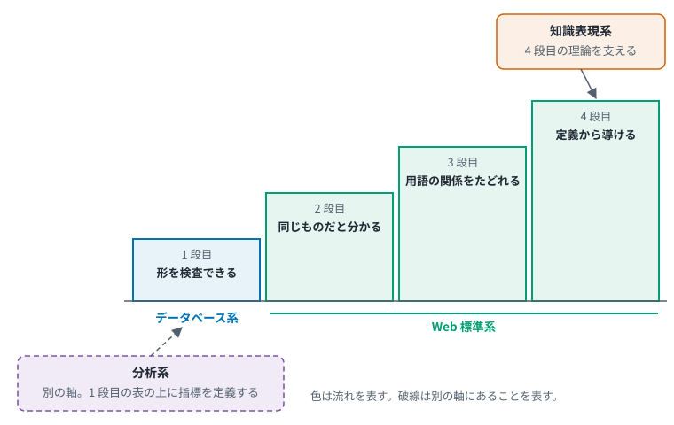{#fig-el-ladder-streams width=90%}

| 流れ | 対応する段 | 説明 |
|---|---|---|
| データベース系 | 1 段目 | データの形を決める。関係モデル、実体関連モデル、プロパティグラフがここにあたる |
| Web 標準系 | 2、3、4 段目 | 2 段目が RDF、3 段目が SKOS、4 段目が RDF Schema と OWL である。1 段目の XML Schema も含む。SHACL と DCAT は一つの段に収まらない（@tbl-off-ladder）が、これも Web 標準系に属する |
| 知識表現系 | 4 段目 | 4 段目の理論の出どころである。記述論理が OWL の形式的な基礎になった。上位オントロジーは 4 段目で書かれる中身にあたる |
| 分析系 | 別の軸にある | 1 段目の表の上に、指標の定義を置く |

: 四本の流れと意味の 4 段階の対応（筆者の整理） {#tbl-ladder-streams}

筆者はこの対応から、次の三点を読み取る。

1. 2 段目から上を担うのは Web 標準系である。データベース系は 1 段目にとどまる。@tbl-ladder に挙げた 2 段目から 4 段目の代表的な技術（RDF、SKOS、RDF Schema、OWL）は、いずれも Web 標準系の仕様である。
2. 4 段目には二つの流れが関わる。知識表現系が理論を、Web 標準系がその標準化を担った。記述論理が OWL の形式的な基礎であることは、出典で確認できる [@w3c_owl_2004]。
3. 分析系は別の軸にある。段を上がるのではなく、指標の計算方法という別の課題を解いている。



# データモデルとメタデータの標準化 {#sec-datamodel}

この章の標準は、そろえる対象で二つに分けられる。データや文書の形をそろえるものと、項目の名前に使う言葉をそろえるものである。

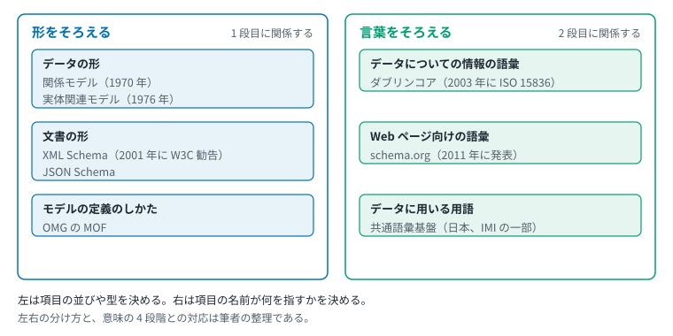{#fig-el-datamodel-map width=95%}

関係モデルは 1970 年、実体関連モデルは 1976 年に論文として発表された [@codd_1970; @chen_1976]。モデルそのものを定義する側では、OMG の MOF が、モデル駆動アーキテクチャの言語群におけるメタモデル定義の基礎となっている [@omg_mof_251]。

文書の構造を記述する言語には、XML Schema と JSON Schema がある。XML Schema は 2001 年 5 月 2 日に W3C 勧告となった [@w3c_xmlschema_2001]。JSON Schema は、JSON データの構造と制約を定義する宣言的な言語である [@json_schema_what]。

メタデータの語彙としては、ダブリンコアがある。その歴史は、Web 資源のための中核的な意味の集合を議論した OCLC/NCSA メタデータワークショップに始まる [@dcmi_history]。ISO 15836 として 2003 年に初めて発行され、最後の改訂は 2017 年の ISO 15836-1:2017 である [@dcmi_terms]。

Web ページ向けの語彙である schema.org は、2011 年 6 月 2 日付の記事で、Google、Bing、Yahoo! の取り組みとして発表された [@google_schema_org_2011]。公式ページは、創設企業として Google、Microsoft、Yahoo、Yandex を挙げている [@schema_org_about]。

日本では、IMI（情報共有基盤）の一部である共通語彙基盤が、データに用いる用語の表記・意味・構造の統一を掲げている [@imi_ipa]。

# ドメインオントロジーと業界標準 {#sec-domain}

| 分野 | 名称 | 公式サイト等による説明 | 出典 |
|---|---|---|---|
| 金融 | FIBO | OWL で開発されたオントロジー。OMG でも標準化 | [@edmc_fibo] |
| 生命科学 | Gene Ontology | 生物学的知識の構造化され標準化された表現 | [@go_docs; @ashburner_2000] |
| 生命科学 | OBO Foundry | 生物科学のための相互運用可能なオントロジーのコミュニティ開発 | [@obo_foundry] |
| 医療 | SNOMED CT | 多言語の臨床医療用語集 | [@snomed_what] |
| 医療 | HL7 FHIR | HL7 が発行する医療データ交換の標準 | [@hl7_fhir] |
| プロセス産業 | CFIHOS | 産業施設の情報引き渡しのための標準化された仕様 | [@cfihos] |
| 製造 | アセット管理シェル（AAS） | 各アセットをデジタルに表現する。IDTA が推進し、構造は IEC 63278-1:2023 が定義する | [@idta_home; @iec_63278_1_2023] |
| 製造 | ECLASS | 製品マスタデータを業種・国・言語・組織を越えて交換可能にする | [@eclass_intro] |
| 製造 | Industrial Ontologies Foundry | デジタル製造の全領域にわたるオープンな参照オントロジー群の作成 | [@oagi_iof] |
| 上位 | BFO | ISO/IEC 21838-2:2021 に収められた上位オントロジー | [@iso_21838_2_2021] |
| 中位 | Common Core Ontologies | あらゆる領域に共通する汎用的な用語と関係を定義する 11 のオントロジー群（2026-10-02 時点の README の記載） | [@cco_readme] |
| 行政（米国） | NIEM | 公共部門と民間部門の組織間で情報を交換する枠組み | [@niemopen_2023] |

: ドメインオントロジーと業界標準 {#tbl-domain}

表の説明は各団体の自己記述にもとづくもので、中立な評価ではない。

@tbl-domain の標準は、どれもオントロジーというわけではない。概念と関係を定義するもの、言葉や項目をそろえるもの、やり取りの形を決めるものが混ざっている。分野と種類で並べ直すと @fig-el-domain-map のようになる。

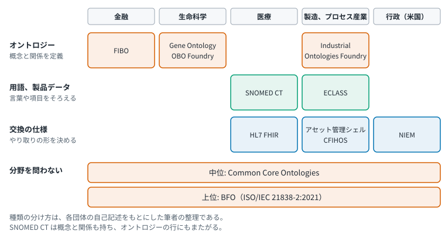{#fig-el-domain-map width=95%}

この配置は、自己記述の文言だけから決めたものである。たとえば SNOMED CT は臨床の用語集と説明されるが、中核の要素に概念と関係を持ち、オントロジーの行にもまたがる [@snomed_what]。各標準の中身を比べた結果ではなく、種類の境目もはっきりしたものではない。上位と中位のオントロジーの関係は @fig-el-upper-ontology に示した。

# 米国企業の近年の取り組み {#sec-us}

この章では、米国企業の動きを五つに分けて見る。以下、表の順に説明する。

| 順 | 動き | 代表 | 狙い | 意味の 4 段階との関係 | 節 |
|---|---|---|---|---|---|
| 1 | 知識グラフ | Google のナレッジグラフ、Wikidata | 事物とその関係を、グラフで持つ | データモデルによる。RDF で書けば 2 段目の仕組みを使う | @sec-us-kg |
| 2 | 製品のオントロジー | Palantir | データを業務の操作と結ぶ | またがる。1 段目から 3 段目 | @sec-us-palantir |
| 3 | セマンティックレイヤ | Looker、Power BI、dbt | 指標の定義を一か所に置く | 別の軸にある | @sec-us-sl |
| 4 | 交換のための仕様 | OSI、Apache Ossie | 定義をツールの間でそろえる | 別の軸から、意味の定義へ広がる | @sec-osi |
| 5 | 文脈を渡す形式 | Open Knowledge Format | 知識を文章のまま AI に渡す | またがる。下の段を薄く備える | @sec-okf |

: 米国企業の動きの見取り（筆者の整理） {#tbl-us-overview}

3 から 5 は、分析系の流れに属する。1 と 2 は、四本の流れのどれか一つには収まらない。知識グラフは知識表現系と Web 標準系の両方に関わり、製品のオントロジーは四本の外にある（@tbl-compare）。「意味の 4 段階との関係」の列は筆者の整理である。

## 知識グラフ {#sec-us-kg}

Google は 2012 年 5 月 16 日付の記事でナレッジグラフを紹介し、「things, not strings」（文字列ではなく事物）という表現を用いた [@google_kg_2012]。Wikidata は自らを、自由で協働的な多言語の二次的な知識ベースと説明している [@wikidata_intro]。

![Wikidata のデータモデル。一つの項目が、プロパティと値の組からなる文のかたまりを持ち、それぞれに修飾子と情報源が付く。出典: Charlie Kritschmar (WMDE), Datamodel in Wikidata, Wikimedia Commons, CC0 [@wikimedia_wikidata_datamodel]。](figures/ext-wikidata-datamodel.png){#fig-wikidata width=80%}

@fig-wikidata は知識グラフの一つの例である。「ダグラス・アダムズは St John's College で教育を受けた」という事実が、期間などの修飾子と、根拠となる情報源とともに記録されている。

グラフのデータモデルの代表的なものに、RDF とプロパティグラフがある [@hogan_2021]。後者については、ISO/IEC 39075:2024（GQL）がデータ構造と基本操作を定義する [@iso_39075_2024]。Neo4j は、プロパティグラフはデータ交換形式ではなくデータベースモデルとして設計されたと説明しているが、これは製品ベンダ自身の説明である [@neo4j_rdf_vs_pg_2024]。

言語モデルとの組み合わせでは、Microsoft Research が 2024 年 2 月 13 日付のブログ記事で GraphRAG を紹介した [@msr_graphrag_2024]。

## 製品としてのオントロジー：Palantir {#sec-us-palantir}

Palantir は自社の Ontology を次のように定義している [@palantir_ontology_overview_2026]。

> "The Palantir Ontology is an operational layer for the organization."
>
> （訳：Palantir Ontology は、組織のための運用レイヤである。）

同社の説明では、Ontology は意味要素（semantic elements：オブジェクト、プロパティ、リンク）と動的要素（kinetic elements：アクション、関数、動的セキュリティ）の両方を含む [@palantir_ontology_overview_2026]。

![Palantir の Ontology の例。航空業界の 5 つのオブジェクト型と、それらを結ぶリンク型を示す。Palantir の公式文書の図 [@palantir_core_concepts] をもとに筆者が作成した。](figures/el-palantir.svg){#fig-el-palantir width=90%}

@fig-el-palantir は意味要素の例である。空港、フライト、航空会社といったオブジェクト型が、それぞれプロパティを持ち、リンク型で結ばれている。

公式文書をもとに、Palantir の Ontology が @sec-ladder の意味の 4 段階のどこまでを備えるかを整理すると、次のようになる。

| 段 | Palantir の Ontology での対応 | 判定 | 出典 |
|---|---|---|---|
| 1 段目（形を検査できる） | 必須プロパティは、値を持たなければならないプロパティである。値型は、検証の制約を伴う。主キーは一意でなければならない | 備える | [@palantir_required_properties; @palantir_value_types; @palantir_property_metadata] |
| 2 段目（同じものだと分かる） | 既存のデータ源を、共通のオブジェクト、プロパティ、リンクに対応づける。一つのオブジェクト型は複数のデータソースを背後に持てる。ただし突き合わせは主キーの一致による | 備える。一つの基盤の中に限る | [@palantir_ontology_overview_2026; @palantir_mdo] |
| 3 段目（用語の関係をたどれる） | インターフェースは別のインターフェースを拡張でき、子はプロパティを継承する。これは型の継承であり、用語の上位と下位や言い換えを扱う仕組みではない | 一部。型の継承はある | [@palantir_interfaces] |
| 4 段目（定義から導ける） | 派生プロパティは、他のプロパティやリンクの値から実行時に計算される。関数は TypeScript か Python で書く。定義からの論理的な推論にあたる記述は見当たらない | 見当たらない | [@palantir_derived_properties; @palantir_functions] |

: Palantir の Ontology と意味の 4 段階の対応 {#tbl-palantir-ladder}

「見当たらない」は、Ontology 関連の公式文書およそ 180 ページを検索した結果である。存在しないことの証明ではない。

W3C の標準との関係について、公式文書には次の記述がある。

- Foundry のデータ型は、RDF、OWL、XSD の類似の概念に着想を得ている [@palantir_type_reference]。調査した範囲で RDF と OWL に触れるのはこの一文だけで、対象はデータ型に限られる。
- Ontology のスキーマ定義は JSON ファイルに保存され、書き出しと取り込みができる。ただし、書き出した JSON のスキーマは変わりうるので依存すべきでないとされている [@palantir_export_import]。
- 共有プロパティが共有するのはメタデータであり、背後のデータではない [@palantir_shared_properties]。

Palantir は、自社の Ontology はセマンティックレイヤではないとも述べている [@palantir_ontology_system_2026]。

**考察**

Palantir の Ontology は、意味の 4 段階のうち 1 段目と 2 段目を、一つの基盤の中で、独自の形式で実現している。3 段目は型の継承という形で一部を備える。4 段目にあたる推論は、宣言された定義から導くのではなく、コードで書いた計算として実現している。

したがって同社の用法は、OWL のような論理的な推論よりも、データと業務上の操作を結びつけることを重視していると考えられる。

標準化された交換形式を持たない点は、組織をまたぐ意味の共有という観点では制約になると考えられる。書き出しの形式が安定していないことは、公式文書が自ら述べている。

## 分析系のセマンティックレイヤ {#sec-us-sl}

指標やディメンションという言葉になじみのない読者は、先に @sec-el-sl の補足を読むとよい。

Google は Looker を、指標を一度定義してどこでも使えるセマンティックモデルを中核とする設計だと説明している [@google_looker_2024]。
Microsoft は Power BI の「データセット」を「セマンティックモデル」に改称した [@ms_learn_semantic_model]。時期は 2023 年 11 月である [@webb_semantic_models_2023]。時期の出典は二次情報である。
Databricks は 2026 年 4 月 2 日付の記事で、Unity Catalog Business Semantics の一般提供とオープンソース化を告知した [@databricks_semantics_2026]。
dbt Labs は MetricFlow を Apache 2.0 ライセンスでオープンソース化すると発表した [@dbt_metricflow_2025]。

::: {.callout-note}
## コラム：分析系はなぜ別の流れとして現れたのか（考察）

意味を扱う技術には、RDF や OWL という標準がすでにある。それなのに、分析系のセマンティックレイヤは別の流れとして育った。

一つの仮説はこうである。既存の手法や道具は、高度すぎるか複雑すぎた。一方、データ基盤の事業者に必要だったのは、分析ツールや BI から安定して使ってもらうことだった。それに足る機能が備わっていれば十分だった。

追加の調査で、この仮説の後半は裏づけられた。前半は、直接の裏づけが見つからなかった。順序にも修正が要る。

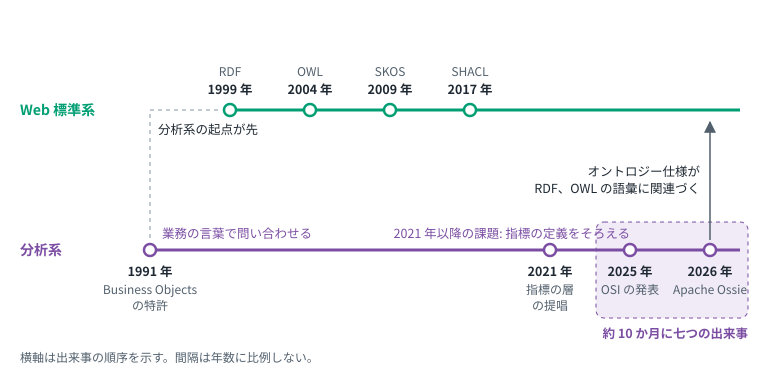{#fig-el-two-streams width=95%}

**分析系の起点は、Web 標準系より古い**

分析系の源流は、RDF より前にさかのぼれる。Business Objects の特許は 1991 年に出願され、利用者が関係構造や SQL を知らなくても、なじみのある業務の言葉で関係データベースに問い合わせられるようにする技術を記述している [@business_objects_patent_1996]。特許は「セマンティックレイヤ」という語を使っていない。これを分析系の起点と見るのは、筆者の位置づけである。RDF の最初の仕様は 1999 年である [@w3c_rdf_1999]。分析系は、既存のセマンティック技術の代わりとして作られたのではなく、別の課題から先に始まっていた。

**2021 年以降の課題は、指標の定義をそろえることである**

2021 年には、指標の計算方法をツールごとに定義するのをやめ、一か所で決めるという考え方が提唱された [@stancil_metrics_layer_2021]。dbt Labs は、指標の定義を BI の層からモデリングの層へ移せば、どのツールでも同じ定義を使えると説明している [@dbt_semantic_layer_docs]。OSI の発表文は、AI と BI のアプリケーションで一貫した業務ロジックを確保することを狙いに挙げた [@snowflake_osi_pr_2025]。Apache Ossie の README も、同じ KPI がツールごとに違う定義になっていることを問題に挙げる [@ossie_readme]。

どれも当事者の説明だが、求めているものは共通している。指標とディメンションと結合の定義であり、定義からの推論ではない。仮説の後半は、これらの説明と合う。

**複雑すぎたから避けた、という直接の証拠はない**

分析系の事業者や Ossie の文書の中に、RDF や OWL を採らない理由を述べたものは見つからなかった。

一般論としては、複雑さを指摘する議論がある。Hogan は、セマンティックウェブの標準は長く複雑で理解しにくく、新しい利用者を引きつける障壁になっているという批判を紹介している。ただし同じ箇所で、SQL の標準も大部だが中核は広く使われている、という反論も併記している [@hogan_semantic_web_2020]。複雑さだけで説明できるとは、この論文も結論していない。

実態としては、指標のための語彙やオントロジーは存在するが、セマンティックレイヤの界隈では使われていないようだ、という署名記事の観察がある [@anadiotis_universal_semantic_layer]。

**いまは近づいている**

Apache Ossie のオントロジー仕様は、概念や関係を、既存の RDF や OWL の語彙の定義に関連づけられるようにしている [@ossie_ontology_spec]。ロードマップは、概念的な相互運用性が未解決だと認めている [@ossie_roadmap]。

**まとめ**

分析系は、複雑な既存技術を避けて生まれたというより、別の課題を、それに足る機能で解いてきたと見るほうが、証拠に合う。複雑さが普及の妨げになったという見方には一定の支持があるが、分析系の当事者がそれを理由に挙げた証拠は見つかっていない。

いま両者が近づいているのは、AI に意味を渡すには指標の定義だけでは足りなくなったためだと推測される。ツールごとに名前や構造が違う概念を対応づけるという課題は、Web 標準系が取り組んできた課題と重なる。

**これをどう読むか**

分析系は、Web 標準系の簡易版でも、代わりでもない。別の課題を解いてきた流れが、いま意味の定義の領域に入ってきた、と読むのがよいと考えられる。

動きは活発である。2025 年 9 月から 2026 年 7 月の約 10 か月に、七つの出来事が続いた（@tbl-timeline、@tbl-okf）。OSI の発表、MetricFlow のオープンソース化、OSI 仕様の公開、Databricks の一般提供とオープンソース化、Open Knowledge Format の発表、Ossie の Apache Incubator 入り、Open Knowledge Format の 0.2 版である。それ以前の分析系の出来事は、年表では 1991 年と 2023 年の二つだけである。

成熟度は低い。Ossie はインキュベーションの段階にあり、Open Knowledge Format は 0.2 版である。それでも注目に値すると筆者が考える理由は、三つある。

- **誰が動かしているか**: すでに広く使われているデータ基盤と BI の事業者である。競合する事業者が、同じ仕様のワーキンググループに参加している [@snowflake_osi_spec_2026; @ossie_update_2026_04]。
- **どこへ向かっているか**: 指標の定義から、概念や文脈といった意味の定義へ、範囲を広げている（@sec-osi、@sec-okf）。これは Web 標準系が取り組んできた課題と重なる。
- **何が後押ししているか**: 読み手に AI が加わったことである。各社の発表が、そろって AI を読み手に挙げている（@sec-axes）。

ただし、言い過ぎには注意が要る。根拠はすべて当事者の発表であり、採用の実績は評価していない。仕様が一本にまとまるとも限らない。Ossie、Open Knowledge Format、各社の仕組みが並んでいる。過去にも共通化の試みがあったかどうかは、本調査では調べていない。
:::

## Open Semantic Interchange から Apache Ossie へ {#sec-osi}

| 時点 | 出来事 | 出典 |
|---|---|---|
| 2025-09-23 | Snowflake が Salesforce、BlackRock、dbt Labs、RelationalAI 等とともに OSI を発表 | [@snowflake_osi_pr_2025] |
| 2026-01-27 | 仕様の最初の版を Apache 2 ライセンスのリポジトリで公開。Databricks、AtScale、Qlik 等がワーキンググループに参加 | [@snowflake_osi_spec_2026] |
| 2026-04-28 | コミュニティ更新で新たな参加者を列挙 | [@ossie_update_2026_04] |
| 2026-06-22 | Apache Incubator でインキュベーション開始（Apache 側の記録） | [@incubator_ossie_status] |
| 2026-07-10 | プロジェクトがブログ記事で、Apache Incubator への受け入れと Apache Ossie (Incubating) への改称を公表 | [@ossie_incubator_2026] |

: OSI と Apache Ossie の経過 {#tbl-osi}

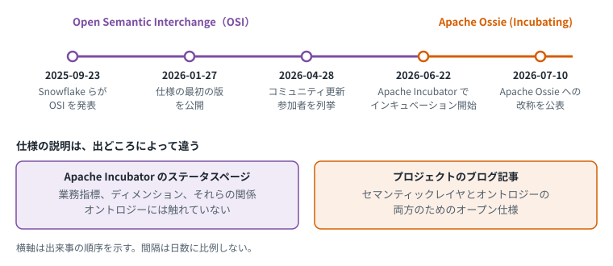{#fig-el-ossie-timeline width=95%}

2026 年 4 月の更新が列挙する参加者には、Oracle、Cloudera、Dremio が含まれる [@ossie_update_2026_04]。

プロジェクトのブログ記事は Ossie を次のように説明している [@ossie_incubator_2026]。

> "Ossie is an open specification for both semantic layer and ontology."
>
> （訳：Ossie は、セマンティックレイヤとオントロジーの両方のためのオープン仕様である。）

一方、Apache Incubator のステータスページは、業務指標、ディメンション、それらの関係を表すベンダ中立の形式を定義するオープン仕様と説明しており、オントロジーには触れていない [@incubator_ossie_status]。

リポジトリの README は、仕様を JSON と YAML にもとづくものと記している [@ossie_readme]。

ロードマップは、オントロジーを加える理由を説明している。現在の Ossie が解決するのは構造的な相互運用性であり、別々のモデルが同じ業務概念を違う名前や構造で書いている場合の、概念的な相互運用性はまだ解決していないという [@ossie_roadmap]。オントロジーで意味を定義する先例として、Palantir と Goldman Sachs Legend を挙げている [@ossie_roadmap]。

**考察**

OSI は、指標とディメンションの交換という分析系の課題から始まった。
オントロジーは、改称より前から範囲に入っていた。2026 年 4 月の更新は、オントロジーの表現を扱うワーキンググループを挙げている [@ossie_update_2026_04]。7 月のブログ記事では、仕様の説明そのものに「ontology」が入った。分析系が意味の定義へ範囲を広げている兆候と考えられる。
近づいている相手は二つある。ロードマップが先例として挙げるのは、Palantir のような製品のオントロジーである [@ossie_roadmap]。一方、オントロジー仕様は、概念や関係を既存の RDF や OWL の語彙に関連づけられるようにしている [@ossie_ontology_spec]。製品のオントロジーと Web 標準系の両方に近づいていると考えられる。
ただし、Apache 側の公式な説明にこの語はない。プロジェクトの総意としての位置づけかどうかは確認できていない。
仕様は Apache のインキュベーション段階にあり、成熟度や採用実績も本調査では評価していない。

## 言語モデルに文脈を渡す形式：Open Knowledge Format {#sec-okf}

Google Cloud は 2026 年 6 月 12 日付のブログ記事で、Open Knowledge Format（OKF）を発表した [@google_okf_intro_2026]。記事は OKF を次のように説明している。

> "an open specification that formalizes the LLM-wiki pattern into a portable, interoperable format"
>
> （訳：LLM ウィキのパターンを、持ち運べて相互運用できる形式として定めたオープン仕様）

記事の著者は、Google Cloud のデータ分析と BigQuery の技術リードである [@google_okf_intro_2026]。

| 時点 | 出来事 | 出典 |
|---|---|---|
| 2026-06-12 | 0.1 版を発表。知識を、YAML の前書きつき Markdown ファイルのディレクトリで表す | [@google_okf_intro_2026] |
| 2026-07-24 | 0.2 版を発表。来歴、信頼、ライフサイクル、検証を、前書きの項目として加えた | [@google_okf_v02_2026; @okf_spec_2026] |

: OKF の経過 {#tbl-okf}

仕様と README の要点は次のとおりである。

- 一つの概念を、一つの Markdown ファイルで表す。前書きで常に必須なのは `type` だけである [@okf_spec_2026]。
- `type` の値は、中央に登録されない。読む側は、知らない型を受け入れなければならない [@okf_spec_2026]。
- 概念の間は、通常の Markdown のリンクで結ぶ。関係の種類は、リンクそのものではなく、周りの文章が伝える [@okf_spec_2026]。
- 仕様は、概念の型の固定の分類を定めることを、目的としないものに挙げている [@okf_spec_2026]。
- 仕様は、組織をまたいで交換されることも想定している [@okf_spec_2026]。
- README は、OKF が表すものを「カタログの知識」と呼び、既存のデータカタログからの書き出しを作り手の一つに挙げている [@okf_readme_2026]。

0.2 版の記事は、0.1 版と同じく最小限の決まりだけを定める形式のままだと述べている [@google_okf_v02_2026]。同じ版で加わった「検証つきの計算」は、数値が決めたとおりに計算されたかを確かめるための仕組みである。記事は、これが Looker や AtScale などのセマンティックモデルの呼び出しにも対応しうると述べる [@google_okf_v02_2026]。仕様は、今後の課題にセマンティックレイヤのテンプレートを挙げている [@okf_spec_2026]。

調査した範囲では、仕様、README、二つの記事のいずれにも、RDF、OWL、JSON-LD、SKOS への言及は見つからなかった。

**考察**

OKF は、@sec-history の四本の流れのうち、分析系の延長にあると考えられる。著者はデータ分析の担当であり、対象はデータカタログの知識である。型の例にはテーブルや指標が並び、検証つきの計算は「どのツールでも同じ数字」という分析系の課題に答えるものである。

狙いは、知識表現系と重なる。知識表現系は、プログラムが持たない背景知識を書き下して渡そうとした（@sec-el-cyc）。OKF も、言語モデルが持たない組織の文脈を書き下して渡す。違うのは手段である。知識表現系は論理で書いた。OKF は文章で書き、解釈を読み手の言語モデルに任せる。

@sec-ladder の意味の 4 段階に照らすと、OKF は下の段を薄く備えている。Palantir の Ontology と同じく、段ごとに見ると次のようになる。

| 段 | OKF での対応 | 判定 | 出典 |
|---|---|---|---|
| 1 段目（形を検査できる） | 適合の条件は、前書きが YAML として読めることと、`type` が空でないことである。0.2 版は、来歴や状態の項目も前書きに置く | 備える。ただし最小限 | [@okf_spec_2026] |
| 2 段目（同じものだと分かる） | `resource` は、概念が記述する資産を一意に識別する URI である。抽象的な概念には付かない。`type` の値は中央に登録されない | 一部。資産を指す場合に限る。概念や用語を同定する仕組みはない | [@okf_spec_2026] |
| 3 段目（用語の関係をたどれる） | リンクは関係があることを表し、ディレクトリは暗黙の親子関係を表す。ただし関係の種類は周りの文章が伝える。グラフを作る側は、種類のない有向の辺として扱うのが普通とされる | ごく一部。つながりはたどれるが、何の関係かは機械に分からない。広い語と狭い語のような用語の関係は表せない | [@okf_spec_2026] |
| 4 段目（定義から導ける） | 論理的な定義や推論にあたる記述は見当たらない。検証つきの計算は、数値の計算を確かめる仕組みであり、定義からの推論ではない | 見当たらない | [@okf_spec_2026] |

: OKF と意味の 4 段階の対応（筆者の整理） {#tbl-okf-ladder}

つまり OKF は、1 段目を最小限に備え、2 段目と 3 段目はごく一部にとどまる。資産は URI で同定でき、概念の間のつながりもたどれる。しかし、型の語彙は共有されず、何の関係でつながっているかは機械に分からない。意味の多くは本文の文章にあり、その解釈は読み手の言語モデルに任されている。

@tbl-off-ladder では、OKF を「またがる」に分類した。Palantir の Ontology と同じく、一つの段の代表的な技術ではなく、複数の段を一部ずつ備えるためである。

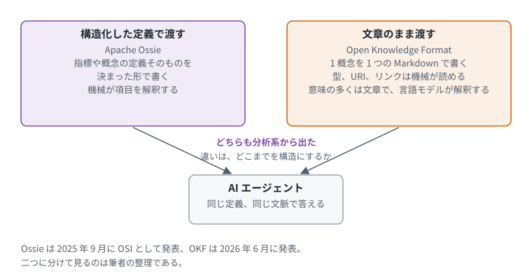{#fig-okf width=90%}

Apache Ossie と並べると、AI に意味を渡す方法が二つに分かれていることが分かる。Ossie は、指標や概念を構造化した定義として渡す。OKF は、文章のまま渡す。どちらも分析系から出て、読み手に AI を挙げている。

ただし、二つの違いは、構造を持つか持たないかではない。どこまでを構造にするかの、程度の差である。OKF も、型、資産の URI、リンクという薄い構造を持つ。Ossie は、指標や概念の定義そのものを構造にする。OKF は、定義の中身を文章に残す。

OKF は 0.2 版の段階にある。ここに書いた内容は当事者の説明にもとづくもので、採用の実績は本調査では評価していない。

# データスペースとの接点 {#sec-dataspace}

データスペースが意味をどう扱っているかを、国際、欧州、日本の順に見る。米国については、データスペースにあたる取り組みを本調査では扱っていない。

## 国際：データスペースプロトコルとその標準化 {#sec-ds-intl}

データスペースプロトコルは、Eclipse Foundation の作業グループ（Eclipse Dataspace Working Group）が公開している仕様である [@eclipse_dsp_iso_2025]。特定の地域のものではないので、最初に扱う。

| 対象 | 意味の扱い | 出典 |
|---|---|---|
| データスペースプロトコル 2025-1 | メッセージは JSON Schema で規範的に定義。JSON-LD 1.1 を使用。独自の名前空間 `dspace` を持つ。カタログは DCAT と ODRL の語彙を再利用し、その再利用は JSON Schema と JSON-LD コンテキストを通じて暗黙に行われる | [@dsp_2025_common; @dsp_2025_catalog; @dsp_2025_context] |

: データスペースプロトコルにおける意味の扱い {#tbl-dataspace-intl}

Eclipse Foundation は 2025 年 12 月 2 日、ISO/IEC JTC1 の PAS 手続きで国際標準化に提出される 2 つのプロトコル仕様の公開を発表した [@eclipse_dsp_iso_2025]。
2 つの仕様は Eclipse Dataspace Protocol と Eclipse Dataspace Decentralised Claims Protocol である [@eclipse_dsp_iso_2025]。
セルビアの標準化機関が掲載する ISO の案件記録によれば、ISO/IEC DIS 26450（Eclipse Dataspace Protocol）は 2026 年 9 月 15 日付で FDIS としての登録が承認された段階にある [@iss_iso_26450]。この記録は ISO 本体のページではなく、各国機関による掲載である。

### データスペースプロトコルの成り立ち {#sec-dsp-history}

データスペースプロトコルは、International Data Spaces Association（IDSA）の中で作られた。0.8 版と 2024-1 版は IDSA の管理のもとで開発され、2024-1 版が Eclipse のプロジェクトへの最初の寄贈となった [@dsp_readme_2025]。

IDSA にはそれ以前から、IDS インフォメーションモデルというオントロジーがあった（@sec-ds-eu）。ただし、データスペースプロトコルがこのオントロジーを基にしているという記述は、調査した範囲では見つからなかった。最初期の 0.8 版は、データ資産を DCAT のカタログとして、利用制御を ODRL のポリシーとして表すとしている [@dsp_v08_readme]。プロトコルは `dspace` という独自の名前空間も定義している [@dsp_2025_context]。

何を規範とするかは、先行する IDS-RAM と、データスペースプロトコルの各版とで違う。IDS-RAM はプロトコルの版ではなく、IDSA の別の仕様である。

| 段階 | 規範の置き方 | 出典 |
|---|---|---|
| IDS-RAM 4.0 | オントロジーである IDS 語彙が、インフォメーションモデルの唯一の規範的な仕様 | [@ids_ram4_information_layer] |
| データスペースプロトコル 2024-1 | メッセージは JSON-LD のコンパクト形式で直列化しなければならない。JSON Schema と SHACL のシェイプが添えられているが、メッセージの型を規範的に定めるものではなかった。版の情報を返すデータだけは、両方に従うとされた | [@dsp_2024_catalog; @dsp_2024_common; @dsp_issue_25] |
| データスペースプロトコル 2025-1 | メッセージは JSON Schema で規範的に定義する。JSON-LD のコンテキストも提供するが、JSON として処理するか JSON-LD として処理するかは実装が選べる | [@dsp_2025_common] |

: 規範の置き方の移り変わり {#tbl-dsp-norm}

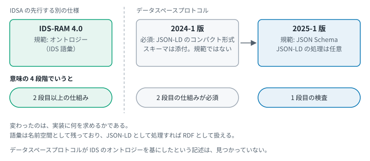{#fig-el-dsp-norm width=95%}

JSON Schema を規範とする変更は、2024 年 9 月の提案に由来する。提案は、当時の仕様がメッセージの型を規範的に定めるスキーマ技術を使っておらず、実装に JSON-LD の処理を強いていることを問題に挙げ、JSON-LD の処理を任意にすることを求めた [@dsp_issue_25]。

**考察：検査の規範が、グラフから文書の形へ移った**

この移り変わりは、意味を捨てたということではない。語彙は名前空間として残っており、JSON-LD として処理すれば RDF として扱える。変わったのは、実装に何を求めるかである。IDS-RAM では、オントロジーがインフォメーションモデルの規範であり、記述の検証には SHACL のシェイプを使うとされた [@ids_ram4_information_layer]。2024-1 版は、メッセージを JSON-LD として扱うことを求めた。2025-1 版は、JSON Schema に合うことを求め、JSON-LD としての処理は任意にした。

@sec-ladder の意味の 4 段階でいえば、規範が 2 段目以上の仕組みから 1 段目の検査へ移ったことになる。実装する側は、RDF やオントロジーを解釈できなくても、JSON の形が合っていれば接続できる。接続のしやすさを優先した選択だと考えられる。提案が相互運用性の妨げとして複雑さを挙げていることは、この解釈と合う。

## 欧州 {#sec-ds-eu}

欧州相互運用性フレームワークは、相互運用性を法的、組織的、意味的、技術的の 4 層で整理する [@ec_eif_2017]。この報告書が扱うのは、このうち意味的な層である。

![欧州相互運用性フレームワークの相互運用性モデル。同文書の図 3 [@ec_eif_2017] をもとに筆者が作成した。意味的な層の強調と右側の説明は筆者が加えた。](figures/el-eif.svg){#fig-el-eif width=95%}

| 対象 | 意味の扱い | 出典 |
|---|---|---|
| IDS インフォメーションモデル | IDS の基本概念を扱う RDFS/OWL オントロジー。契約クラスは ODRL の Policy のサブクラスで、Resource は DCAT-AP 1.1 の属性にもとづく。GitHub リポジトリはアーカイブ済み | [@ids_infomodel_readme; @ids_infomodel_repo; @ids_infomodel_contract_ttl; @ids_infomodel_resource_ttl] |
| Gaia-X | クレデンシャルは、クレームを RDF で表現した W3C 検証可能クレデンシャル | [@gaiax_arch_2404] |
| Catena-X | アスペクトモデルは SAMM に準拠しなければならない。SAMM は Eclipse ESMF のメタモデルで、RDF と Turtle で規定され、SHACL の検証規則を伴う | [@catenax_cx0003; @esmf_samm] |
| DCAT-AP | 欧州でカタログ情報を共有するための DCAT プロファイル。3.0.1 は 2025-10-27 付の SEMIC 勧告 | [@semic_dcatap_301] |
| DSSC ブループリント | データモデルを、語彙、オントロジー、アプリケーションプロファイル、スキーマ仕様を含むものと定義 | [@dssc_blueprint_data_models] |

: 欧州のデータスペースにおける意味の扱い {#tbl-dataspace}

IDS-RAM 4.0 は、宣言的表現である IDS 語彙を、インフォメーションモデルの唯一の規範的な仕様としている [@ids_ram4_information_layer]。このオントロジーは、契約には ODRL、データ資源には DCAT-AP という既存の語彙を取り込んでいた [@ids_infomodel_contract_ttl; @ids_infomodel_resource_ttl]。その後の規範の移り変わりは @sec-dsp-history で述べた。

## 日本 {#sec-ds-jp}

| 対象 | 意味の扱い | 出典 |
|---|---|---|
| ODS-RAM（日本） | データ、トランザクション、アイデンティティ、セマンティクスの 4 レイヤ。セマンティクスレイヤはメタデータの提供による意味とオントロジーの相互運用性を要求 | [@ods_ram_layers; @ipa_ods_press_2026] |

: 日本の ODS-RAM における意味の扱い {#tbl-dataspace-jp}

### ODS の設計思想 {#sec-ods-concept}

IPA は ODS の設計思想を説明する文書を公開している [@ipa_why_ods_2026]。意味の扱いについて、次の考え方が示されている。

| 考え方 | 内容 |
|---|---|
| データモデルと情報モデルの分離 | 観測された事実を記録するデータモデルから、事実の解釈や制約を表す情報モデルを明確に分離する。前者を Data Product、後者を Ontology Product と呼ぶ |
| 開世界仮説を前提にする | Ontology Product では、判断できないことを偽とみなさない開世界仮説を前提とする。Data Product では、閉世界仮説を選択的に導入する。二層の構造である |
| 意味を後から付与する | 先にデータがあり、そこに意味を後から付与する。これをスキーマフレキシブルと呼ぶ |
| RDF、RDF Schema、OWL を使う | RDF で事実を知識の単位として保持し、RDF Schema で語彙と構造を与え、OWL で妥当性や排他性といった制約を定義する |
| 閉世界的な検証を強制しない | SHACL のような閉世界的な検証を強制することは、自己宣言とゆるやかな統合をめざす ODS の発想と相いれないとする。代わりに、二段階の問い合わせを導入する |

: ODS の設計思想における意味の扱い {#tbl-ods-concept}

同文書は、この設計を、意味の所在をコードから論理体系へ移すものと説明している。強みとして挙げるのは、均質な完全性を強制することではなく、開放性を維持しながら選択的な厳格性を実現できる点である [@ipa_why_ods_2026]。

なお、同文書は第一の柱を「Ontology and Semantic Interoperability（OSI）」と呼んでいる [@ipa_why_ods_2026]。@sec-osi の Open Semantic Interchange と略称が同じだが、別のものである。

### ODS のオープンソース実装 {#sec-ods-oss}

ODS は GitHub で実装を公開している。主導する中立的な組織は、IPA のデジタルアーキテクチャ・デザインセンター（DADC）である [@ods_oss_profile]。セマンティクスレイヤにあたるリポジトリを見ると、ODS がオントロジーを実際にどう使っているかが分かる。

| 対象 | 内容 | 出典 |
|---|---|---|
| ODS オントロジー | SDK for Semantics に含まれる。OWL のオントロジーとして宣言され、題は "ODS (Open Data Space) Ontology"。データスペースにおけるデータ交換サービスとエンドポイントを定義する。`ods:DataExchangeService` などのクラスを持つ | [@ods_oss_ontology_ttl] |
| Web サービスの意味定義 | Eclipse ESMF の SAMM をベースとする。SAMM には REST API の呼び出し方を定義する手段がないため、W3C 標準の語彙を組み合わせて API 定義を拡張している | [@ods_oss_sdk_semantics] |
| 領域のオントロジー | サンプルに、ドローン航路の概念を OWL のクラスとして定義したものがある。UASL は Unmanned Aircraft Systems Lines（ドローン航路）の略である | [@ods_oss_uasl_ontology; @ods_oss_profile] |
| RDF の格納と問い合わせ | サンプルの RDF サーバーは、Apache Jena Fuseki に対して SPARQL クエリを実行する | [@ods_oss_sparql_server] |
| 分散カタログ | 複数のドメインアプリケーションが公開する SPARQL エンドポイントから、RDF データを収集して格納する | [@ods_oss_crawler] |
| AI との接続 | チャットサーバは、SAMM アスペクトモデルと API 定義から MCP ツールを生成する | [@ods_oss_chat_server] |

: ODS のオープンソース実装における意味の扱い {#tbl-ods-oss}

MCP（Model Context Protocol）は、AI アプリケーションを外部のシステムにつなぐためのオープンな標準である [@mcp_intro]。

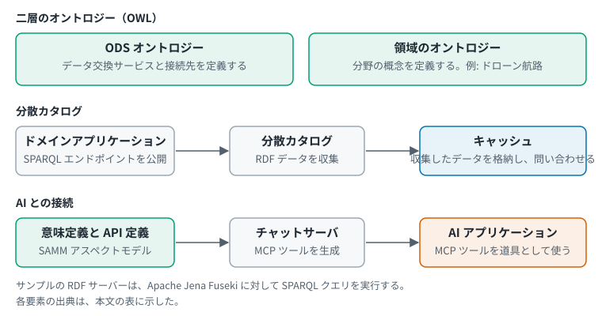{#fig-el-ods-oss width=95%}

**考察**

ODS の実装でいうオントロジーは、@sec-summary の三つの用法のうち Web 標準の用法にあたる。ただし対象は二層に分かれている。一つは ODS オントロジーで、扱うのは業務データの概念ではなく、サービスと接続先である。もう一つは領域のオントロジーで、ドローン航路のような分野ごとの概念を扱う。

意味定義から MCP ツールを生成する実装は、意味をあらかじめ定義して AI に渡すという考え方の具体例と考えられる。

確認した範囲のリポジトリには、SHACL のシェイプは見つからなかった。ただし、全ファイルを確認したわけではない。閉世界的な検証を強制しないという設計思想（@tbl-ods-concept）と合う結果である。

## 考察：データスペースプロトコルと ODS の違い {#sec-eu-jp}

国際の節のデータスペースプロトコルと、日本の節の ODS とでは、何を規範に置くかが違う。

| 観点 | データスペースプロトコル 2025-1 | ODS（日本） |
|---|---|---|
| 規範に置くもの | JSON Schema。メッセージの形を定める | RDF。メタデータは RDF で表現しなければならない |
| オントロジー | 独自の名前空間を持ち、DCAT と ODRL の語彙を再利用する。オントロジーを規範としない | 情報モデルをオントロジーとして分離し、OWL で制約を定義する。これは設計思想の文書の記述で、規範的な要件は確認できていない |
| 検査の考え方 | 文書の形が JSON Schema に合うかを検査する | 開世界仮説を前提にし、閉世界的な検証は強制しない。選択的に導入する |
| 問い合わせ | 仕様の対象外 | SPARQL を取得手段の一つに挙げる |

: データスペースプロトコルと ODS の対比（筆者の整理） {#tbl-eu-jp}

@sec-ladder の意味の 4 段階の上に両者を置くと、@fig-el-dsp-ods のようになる。

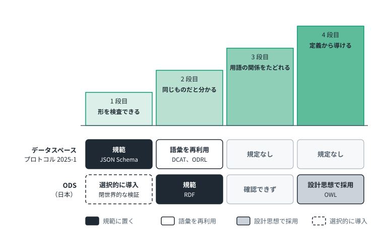{#fig-el-dsp-ods width=90%}

データスペースプロトコルは、1 段目の検査を規範とする [@dsp_2025_common]。2 段目の語彙である DCAT と ODRL は再利用するが、その規範は JSON Schema に置かれている [@dsp_2025_catalog]。3 段目と 4 段目にあたる規定はない。ODS は、2 段目の RDF を規範に置いている [@ods_odp_metadata_exchange]。4 段目の OWL は、設計思想の文書が制約の定義に使うと述べている [@ipa_why_ods_2026]。ただし、OWL を求める規範的な要件は、調査した仕様の文書では確認できなかった。1 段目にあたる閉世界的な検証は、強制せず、選択的に導入する。3 段目にあたる記述は、調査した文書では確認できなかった。

これは優劣ではなく、設計の選択である。データスペースプロトコルは、接続のしやすさを優先したと考えられる（@sec-dsp-history）。ODS は、提供者が不完全な記述のまま参加できる開放性を保ちつつ、意味の矛盾は論理的に検出するという考え方を、設計思想として明示している [@ipa_why_ods_2026]。

この対比は、仕様と設計思想の文書、および公開されている実装の記述にもとづく。実際の運用での違いは確認していない。

# 考察：体系化の試み {#sec-compare}

以下は筆者による整理である。@sec-history の四本の流れを、解く問題、中心となる要素、形式、標準化の場の四つの観点で比べる。製品としてのオントロジーは四本のどれにも属さないので、別の行として加えた。

| 流れ | 解く問題 | 中心となる要素 | 代表的な形式 | 標準化の場 |
|---|---|---|---|---|
| データベース系 | データの保存と共有 | 表、列、キー | 関係モデル、プロパティグラフ | ISO/IEC（GQL など） |
| 知識表現系 | 知識を計算機に扱わせる | 概念、関係、公理 | 記述論理、上位オントロジー | 学術界、ISO/IEC（BFO） |
| Web 標準系 | 組織や領域をまたぐ意味の共有 | クラス、プロパティ、語彙 | RDF、OWL、SHACL、DCAT | W3C |
| 分析系 | 指標の定義の一元化 | 指標、ディメンション、結合 | YAML や SQL による定義 | Apache Software Foundation（Ossie） |
| 製品のオントロジー（四本の外） | データと業務操作の結合 | オブジェクト、リンク、アクション | 製品独自の形式 | 単一の事業者 |

: 四本の流れと製品のオントロジーの比較（筆者の整理） {#tbl-compare}

@tbl-compare は流れごとの違いを示す。これに、@sec-axes の二つの軸を重ねると、主な取り組みの位置が一枚で見える。横に意味の 4 段階、縦に共有の範囲を取ったものが @fig-el-map である。

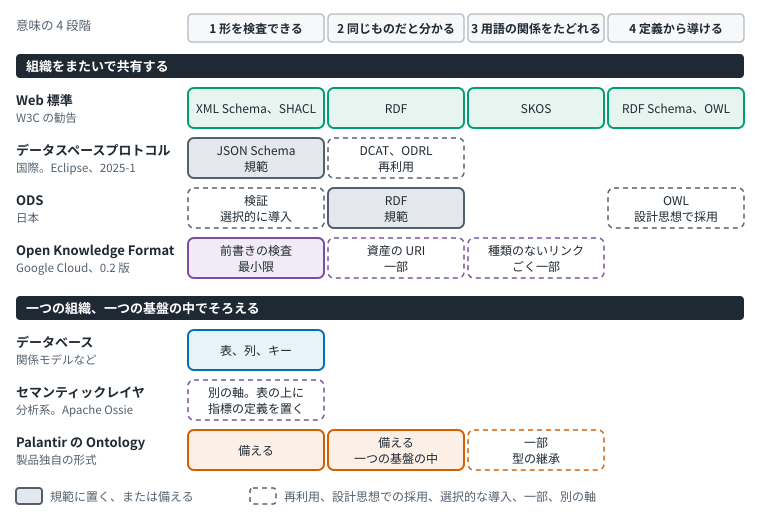{#fig-el-map width=95%}

筆者はこの図から、次のことを読み取る。

- 2 段目以上を規範に置くか、設計思想に掲げる取り組みは、組織をまたぐ側に集まっている。Open Knowledge Format は、仕様が組織をまたぐ交換を想定しているので、こちらに置いた。ただし 2 段目と 3 段目は一部にとどまる。組織の間では、列の名前の意味を口頭ですり合わせる手段がないためと考えられる。
- 一つの組織や基盤の中でそろえる取り組みは、1 段目とその周辺が中心である。Palantir の Ontology は 2 段目に相当する機能を備えるが、範囲は一つの基盤の中に限られる。
- 組織をまたぐ取り組みの間でも、規範に置く段は違う。データスペースプロトコルは 1 段目、ODS は 2 段目である。ODS は 4 段目の OWL も設計思想に掲げるが、規範的な要件は確認できていない（@sec-eu-jp）。

Web 標準の技術そのものは、組織の中でも使える。図の上の段に置いたのは、組織や領域をまたぐ共有を主な狙いとするためである。

**課題から選ぶ**

ここまでの整理を、選ぶ側の立場から並べ直す。何をしたいかから始め、条件で枝分かれして、候補にたどり着く。

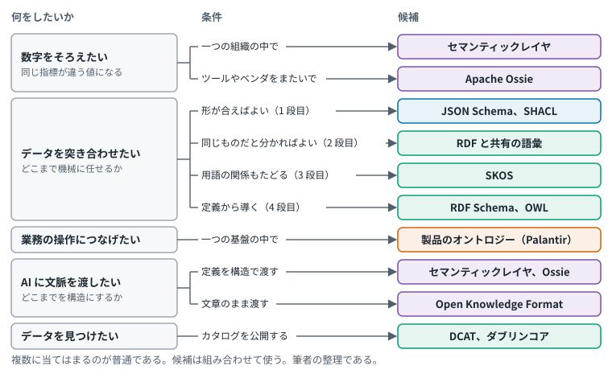{#fig-el-choose width=95%}

| したいこと | 条件 | 候補 | 本報告書の該当箇所 |
|---|---|---|---|
| 数字をそろえたい | 一つの組織の中で | セマンティックレイヤ | @sec-el-sl |
| | ツールやベンダをまたいで | Apache Ossie | @sec-osi |
| 別々のデータを突き合わせたい | 形が合えばよい（1 段目） | JSON Schema、XML Schema。グラフのデータなら SHACL | @sec-el-schema、@sec-el-shacl |
| | 同じものだと分かればよい（2 段目） | RDF と共有の語彙 | @sec-el-rdf |
| | 用語の関係もたどる（3 段目） | SKOS | @sec-el-skos |
| | 定義から導く（4 段目） | RDF Schema、OWL。領域や上位のオントロジー | @sec-el-owl、@sec-domain |
| 業務の操作につなげたい | 一つの基盤の中で | 製品のオントロジー（Palantir） | @tbl-palantir-ladder |
| AI に文脈を渡したい | 定義を構造で渡す | セマンティックレイヤ、Apache Ossie | @sec-osi |
| | 文章のまま渡す | Open Knowledge Format | @sec-okf |
| データを見つけたい | カタログを公開する | DCAT、ダブリンコア | @sec-el-dcat |

: 課題から候補を選ぶ木の内容（筆者の整理） {#tbl-choose}

**公の指針を、どう組み替えたか**

選び方についての公の指針に、W3C の勧告がある。勧告は、形式的な意味の水準を、データと、最もありそうな用途の両方に合うように選ぶよう勧めている。複雑な語彙は、作るのにも理解するのにも手間がかかり、再利用の妨げになりうるとも述べる。語彙については、共有された語彙、できれば標準化された語彙の用語を使うよう勧めている [@w3c_dwbp_2017]。

この木は、その指針を出発点にして、本調査で分かったことを三つ加えたものである。

| 問い | W3C の勧告 | この木での組み替え | 加えた理由 |
|---|---|---|---|
| どの水準を選ぶか | 形式的な意味の水準を、データと用途に合わせる | 形式性の高さではなく、機械に何をさせたいかで選ぶ。条件を意味の 4 段階にした | 形式性の順と、機械にできることの順は一致しない（@tbl-spectrum-vs-ladder） |
| 何をしたいか | 問いとして立てていない | 最初の枝分かれにした。数字、突き合わせ、業務の操作、AI への文脈、発見の五つ | 同じ「セマンティック」でも、流れが違えば解く課題が違う（@tbl-compare） |
| 誰と共有するか | データを Web に公開する場面を前提にしている | 一つの組織や基盤の中か、組織をまたぐかを条件にした | 製品のオントロジーは一つの基盤の中に限られ、データスペースは組織をまたぐ（@fig-el-map） |
| 誰が読むか | 人とプログラム | AI を読み手に加え、構造で渡すか文章で渡すかを条件にした | 近年の仕様は、読み手に AI を挙げている（@sec-okf） |

: W3C の勧告と、この木の関係（筆者の整理） {#tbl-choose-basis}

**迷ったときの四つの問い**

木の枝で迷ったら、次の四つの問いに戻るとよい。どれも、本調査で見た事例から引き出したものである。例は、部品と供給者の題材で作った説明用のものである。

| 問い | 目安 | 例 | もとになった知見 |
|---|---|---|---|
| 機械に、どこまでさせたいか | 課題を解くのに足りるところで止める。深く作り込むほどよい、とは限らない | 重量の欄に数値が入っているかを確かめたいだけなら、形の検査（JSON Schema）で足りる。定義から導く仕組み（OWL）まで作る必要はない | 集計の数字をそろえる仕組み（セマンティックレイヤ）は、機械に推論させずに課題を解いてきた（@sec-us-sl のコラム）。データスペースプロトコルは、つなぎやすさを優先して、形の検査だけを必須にした（@sec-dsp-history） |
| 書かれていないことを、どう扱いたいか | 誤りにしたいなら検査を、まだ分からないものとして扱いたいなら推論を選ぶ | 供給者が書かれていない部品を、入力の漏れとして止めたいなら検査（SHACL）。漏れではなく不明として残したいなら、定義の言語（OWL） | SHACL は書かれていなければ違反とし、OWL は分からないだけと扱う（@sec-el-shacl、@sec-el-owl）。ODS は後者の考え方（開世界仮説）を前提にし、検査は必要なところだけに入れる（@tbl-ods-concept） |
| AI に、何を任せるか | 間違えると困るものは、決まった形の定義で渡す。背景の説明は、文章で渡す | 「売上」の計算方法は、定義（セマンティックレイヤ）で渡す。その数字を見るときの注意や経緯は、文章（Open Knowledge Format）で渡す | 定義を決まった形で書く仕様（Apache Ossie）と、文章のまま渡す形式（Open Knowledge Format）がある（@sec-okf） |
| 誰と、やり取りするか | 一つの製品の中で足りるうちは、製品の機能でよい。別の組織とやり取りするなら、標準の形式を選ぶ | 社内の一つの基盤で部品と供給者を結ぶだけなら、製品のオントロジー（Palantir）でもできる。取引先と突き合わせるなら、共通の識別子と語彙（RDF）が要る | Palantir は、書き出しの形式が変わりうると公式文書で述べている（@sec-us-palantir）。ODS は、標準の形式（RDF）を必須にしている（@sec-eu-jp） |

: 迷ったときの四つの問い（筆者の整理） {#tbl-choose-rules}

選び始める前に、確かめておくことが三つある。

- **相手の言葉の意味**: 相手が「オントロジー」や「セマンティック」という言葉で何を指しているかを確かめる。「オントロジー」には少なくとも三つの用法がある（@sec-summary）。
- **すでにある言葉**: 項目の名前に使う言葉の一覧（語彙）や、概念の定義（オントロジー）は、作る前に既存のものを探す。W3C の勧告が勧めている [@w3c_dwbp_2017]。分野ごとの標準は @sec-datamodel と @sec-domain にまとめた。
- **組み合わせ**: 候補は、どれか一つを選ぶものではない。同じものだと分かる仕組み（RDF）が、定義から導く仕組み（OWL）の土台になる（@sec-ladder）。

この木と四つの問いは、仕様や公式文書の記述から筆者が組み立てたものである。それぞれの候補を実際に導入した結果は、本調査では評価していない。

以上の整理から、次の三点が言える。

1. 用語の混乱は、同じ語が流れごとに別のものを指すことから生じている。「オントロジー」は知識表現系、Web 標準系、製品でそれぞれ違うものを、「セマンティック」は Web 標準系と分析系で違う課題を指す。
2. 流れは対立するものではなく、解く問題が違う。組織をまたぐデータスペースには Web 標準系が、組織内の分析には分析系が合う。
3. 生成 AI の普及が、意味の定義を機械に渡す必要性を、どの流れでも高めていると推測される。渡し方は二つに分かれている。Apache Ossie のように構造化した定義として渡す方向と、Open Knowledge Format のように文章のまま渡す方向である（@sec-okf）。

# 確認できなかった点と留意事項 {#sec-gaps}

次の事項は一次情報で裏づけられなかった。本文では事実として書いていない。

- 「データモデル標準化」という語そのものの定義。本文の説明は、デジタル庁の政府相互運用性フレームワークと IPA の手引きにもとづく。
- ISO/IEC 11179（メタデータレジストリ）と ISO 15926 の適用範囲と発行年。
- ANSI/X3/SPARC の三層スキーマの年。
- Wikidata の公開日。
- Power BI 改称の発表日。改称の事実は Microsoft の公式文書で確認したが、時期は二次情報による。
- Microsoft と Google の OSI への関与。
- 調査会社によるセマンティックレイヤの定義。
- 分析系で、過去に定義の共通化の試みがあったかどうか。あれば、今回の動きとの違いを確かめる材料になる。
- KL-ONE を OWL の祖先と明言する一次情報。
- 論文「The Semantic Web」本文の定義文。

データスペースプロトコルの ISO/IEC での審議段階は、ISO 本体ではなく各国標準化機関が掲載する記録で確認した（@sec-dataspace）。

Cyc の開始年、OSI の発表内容、各社の製品説明は当事者自身の記述に依拠している。

# 付録 A：用語集 {#sec-glossary .appendix}

| 用語 | 説明 | 出典 |
|---|---|---|
| RDF（Resource Description Framework） | Web 上で情報を表現する枠組み | [@w3c_rdf11_2014] |
| OWL（Web Ontology Language） | 形式的に定義された意味を持つオントロジー言語 | [@w3c_owl2_2012] |
| SKOS（Simple Knowledge Organization System） | 知識組織化体系を共有しリンクする共通データモデル | [@w3c_skos_2009] |
| SHACL（Shapes Constraint Language） | RDF グラフを条件に照らして検証する言語 | [@w3c_shacl_2017] |
| JSON-LD | Linked Data を直列化する JSON ベースの形式。現行は 1.1 | [@w3c_jsonld_2014; @w3c_jsonld11_2020] |
| DCAT（Data Catalog Vocabulary） | データカタログ間の相互運用性のための RDF 語彙。最新は第 3 版（2024-08-22 勧告） | [@w3c_dcat3_2024] |
| MOF（Meta Object Facility） | OMG のメタモデル定義の基礎 | [@omg_mof_251] |
| BFO（Basic Formal Ontology） | ISO/IEC 21838-2:2021 に収められた上位オントロジー | [@iso_21838_2_2021] |
| GQL | プロパティグラフのデータ構造と操作を定義する ISO/IEC 規格 | [@iso_39075_2024] |
| SAMM（Semantic Aspect Meta Model） | RDF と Turtle で規定されたメタモデル | [@esmf_samm] |
| OSI（Open Semantic Interchange） | 2025 年に発表されたセマンティックモデル交換の取り組み。現 Apache Ossie (Incubating) | [@snowflake_osi_pr_2025; @incubator_ossie_status] |
| OKF（Open Knowledge Format） | 知識を、YAML の前書きつき Markdown ファイルのディレクトリで表す形式。Google Cloud が 2026 年に発表した | [@google_okf_intro_2026; @okf_spec_2026] |
| ODS-RAM | Open Data Spaces Reference Architecture Model | [@ipa_ods_press_2026] |

: 用語集 {#tbl-glossary}

# 参考文献 {.unnumbered}

::: {#refs}
:::

# 付録 B：改変履歴 {#sec-changelog .appendix}

公開した版ごとの主な変更を、新しい順に示す。版は日付で表す。


